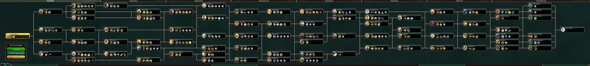

# Civ-TechTree
A 'technology-tree-like' graph dataset

# What is "Civ"

"Civ" stands for [Sid Meier's Civilization](https://en.wikipedia.org/wiki/Civilization_(series)). It is a series of turn-based strategy video games. All the games centered on building a civilization on a macro-scale from prehistory up to the near future. The techology development of a civilization in the games is quite similar to the real history of human being.

The series was first released in 1991. There are six main games in it, now(2019). My favorite version is **Civ5** or [Civilization V](https://en.wikipedia.org/wiki/Civilization_V) with the full(second) expansion pack, [Civilization V: Brave New World](https://en.wikipedia.org/wiki/Civilization_V:_Brave_New_World)("**BNW**" for short). So, the dataset is based on the techology tree of this version "Civ5 BNW".

# What is a "TechTree"

"TechTree" is short for [Technology tree](https://en.wikipedia.org/wiki/Technology_tree). 

In strategy computer games, a technology, tech, or research tree is a **hierarchical visual representation** of the possible sequences of upgrades a player can take (most often through the act of research). Because these trees are technically *directed and acyclic*, they can more *accurately* be described as a **technology directed acyclic graph** in computer science or graph theory. The diagram is tree-shaped in the sense that it branches between each 'level', allowing the player to choose one sequence or another. Each level is called a tier and is often used to describe the technological strength of a player. 

# TechTree of Civ5 BNW

> Download the original image from [civfanatics](https://forums.civfanatics.com/media/techtree-bnw.3607/)
